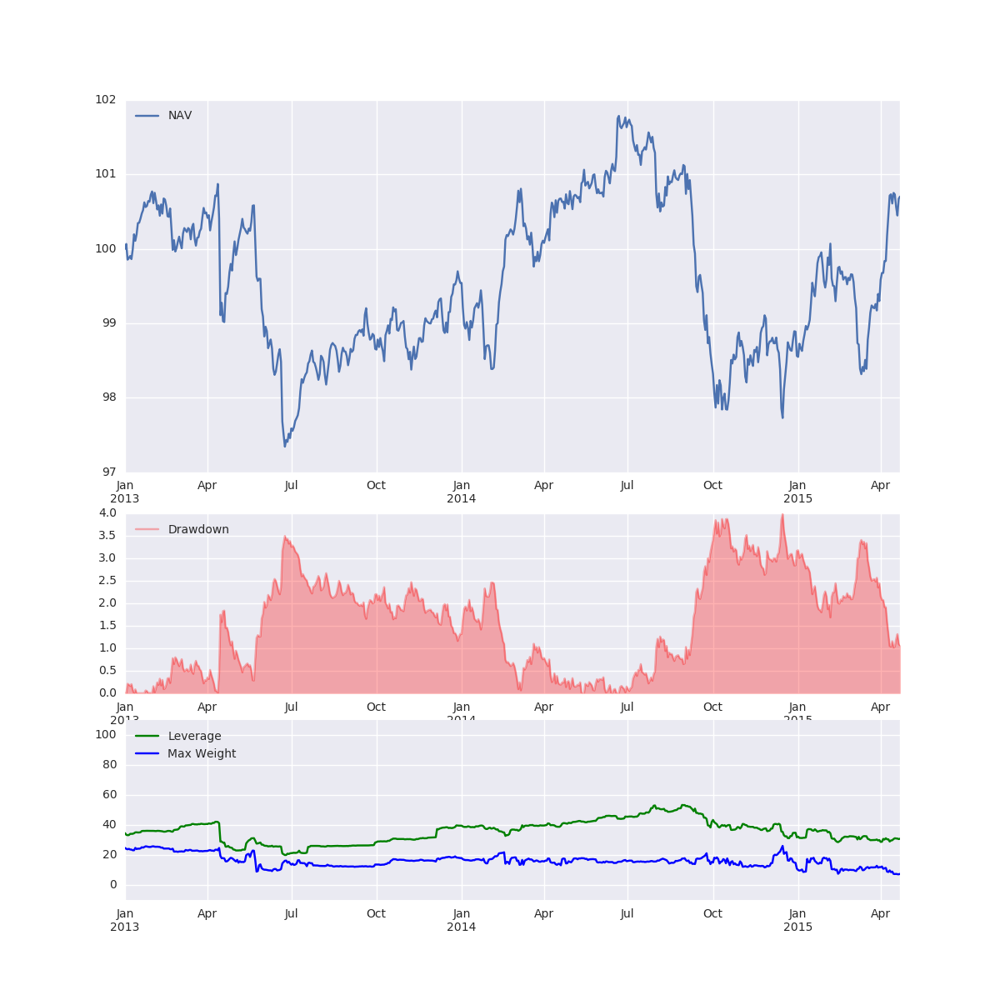

# pyutil

Set of utility code used by Lobnek Wealth Management.
[](https://travis-ci.org/lobnek/pyutil)

## Installation
```python
pip install git+http://github.com/lobnek/pyutil.git
```

## Running a strategy



Our main concern is to implement and maintain strategies in a robust way. We do not rewrite our codes for production servers 
in alternative programming languages. We use the same Python scripts both in research and production. 

A strategy is a script loading time series data from an archive and using parameters specified a priori.
For research it is helpful to interfere with the parameters before the strategy iterates in a backtest through history.

It is possible to point the strategy to different reader (objects). 
For testing purposes we fire up and populate a MongoDB Docker image 
whereas in production we run a MongoDB server providing access to our latest data.

Each strategy is described by a class Configuration and is a child of the ConfigMaster class.

[ConfigMaster](pyutil/strategy/ConfigMaster.py)

Although inheritance is rarely used in Python we use it here to enforce a small common interface for all strategies.
A simple test strategy is implemented here:

[Test Strategy](test/test_strategy/scripts/script_a.py)

The ConfigMaster class offers an assets property. Assets are a collection of Asset objects:

[Asset](pyutil/mongo/asset.py)

and

[Assets](pyutil/mongo/assets.py)


The link between an actual data source (e.g. a database) and the ConfigMaster is done via the reader function.
The reader function maps the name of an asset to an actual Asset object as shown in

[Test ConfigMaster](test/test_strategy/test_configmaster.py)

Note that there are many alternative implementations of such a reader function possible. This very much depends
on the underlying technology used to store data.
